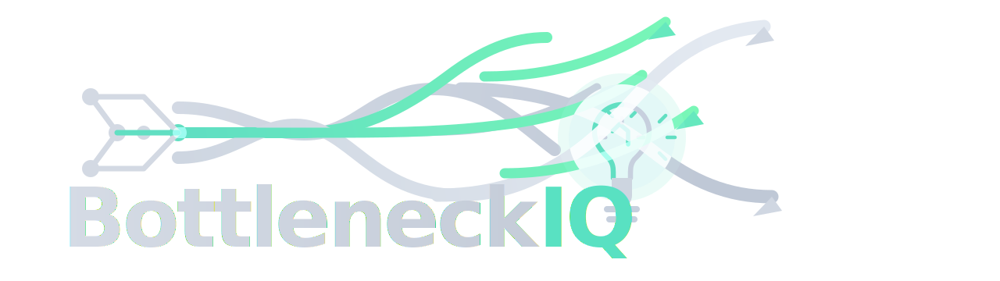

# BottleneckIQ

BottleneckIQ is a warehouse bottleneck detection and ROI analysis platform built for small and mid-sized e-commerce operations.

This repository is a public project showcase. The core source code remains private.

## Demo Video

## Sample PDF Report

[View the sample BottleneckIQ report](./BottleneckIQ_Report.pdf)

The sample report highlights:

- Primary bottleneck call
- Confidence / reliability view
- Time-based bottleneck analysis
- Business-case / ROI impact
- Executive-facing evidence and summary reporting

## Project Overview

BottleneckIQ was built to help warehouse teams answer five core questions:

- Where is the real bottleneck?
- How reliable is that bottleneck call?
- Why was that operation flagged?
- How does the bottleneck behave across the day?
- What is the likely monthly business impact if it is improved?

The platform merges event-level warehouse data across core operations and turns it into a decision-support workflow for operations and commercial teams.

## Industrial Engineering Foundation

BottleneckIQ is grounded in Industrial Engineering and Theory of Constraints (TOC), with a focus on warehouse flow, operational constraints, reliability, and decision-support.

The product is designed to move beyond surface-level reporting and turn operational complexity into a clearer management view and a more actionable bottleneck call.

Its goal is not to expose internal scoring logic, but to apply a serious operations framework to real warehouse decision making.

## What The Product Shows

- Primary bottleneck detection across inbound and outbound warehouse flow
- Reliability breakdown for decision confidence
- Executive-facing evidence explaining why an operation was flagged
- Inbound and outbound bottleneck views
- Bottleneck-over-time analysis
- Micro-bottleneck detection
- ROI / business-case output with customer-facing reporting
- PDF export for stakeholder-ready summaries

## What Makes It Different

- Built around a proprietary multi-signal bottleneck scoring and validation approach
- Designed for real warehouse operations rather than simplified dashboard-only examples
- Connects operational diagnosis to business value instead of stopping at visualization
- Combines analytics, product design, reporting, and decision support in one workflow

## Tech Stack

- Python
- Streamlit
- pandas
- NumPy
- Altair
- Matplotlib
- pdfkit
- Excel / OpenPyXL-based ingestion

## Input Scope

The platform is designed around warehouse event data such as:

- `Order_ID`
- `Start_Time`
- `End_Time`

and can also benefit from optional operational context such as:

- `Location`
- `Staff_ID`
- `Line_Count`
- `Unit_Count`

Core operation coverage:

- Receiving
- Putaway
- Replenishment
- Picking
- Packing
- Shipping

## Context

This project was developed as an Industrial Engineering portfolio project focused on:

- warehouse operations
- bottleneck analysis
- operational reliability
- process flow visibility
- modeled business impact

## Access Note

This repository is shared for portfolio and evaluation purposes only.

The full application source code, scoring logic, and internal implementation are kept private.
